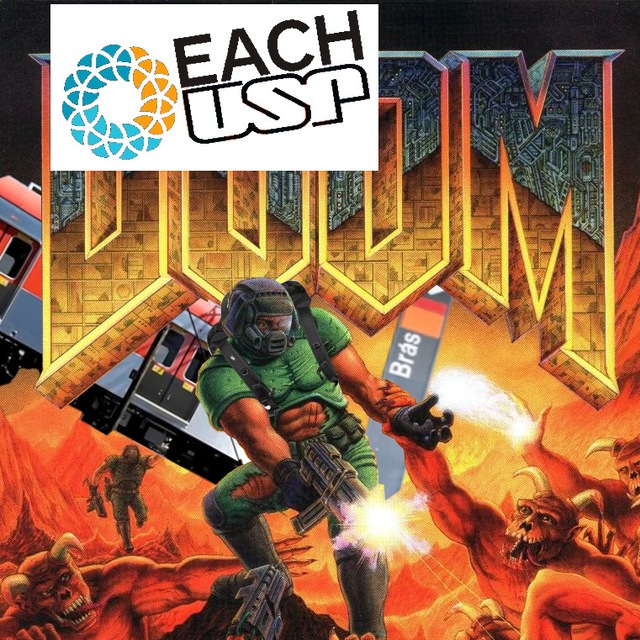

# EACH in DOOM
Recriamos a EACH no DOOM! Resultados podem variar...

# Licenças

Todo e qualquer objeto de arte de produção própria estão licenciados sob CC BY-NC-SA 4.0.

Toda e qualquer linha de código de produção própria estão licenciadas sob GPLv2.
